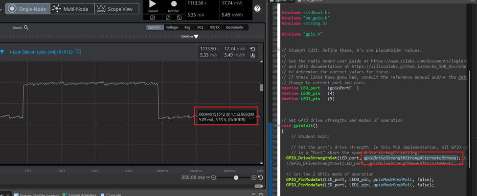
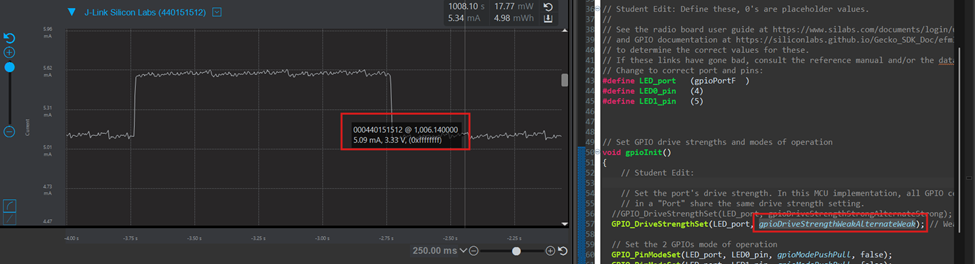
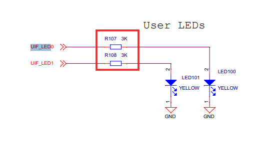
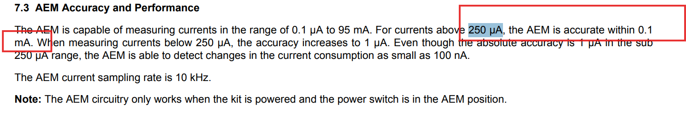
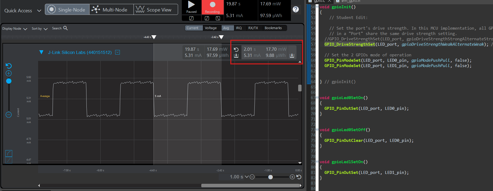
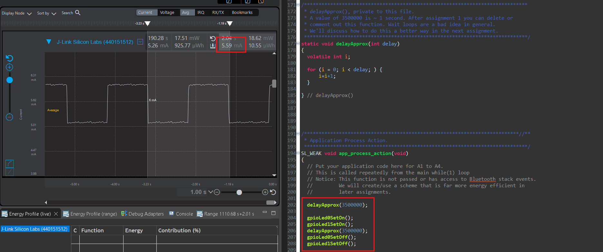

Note: For all assignments and Energy Profiler measurements you’ll be taking this semester,  Peak measurements are instantaneous measurements taken at a specific point in time. In the Energy Profiler, this is accomplished by left-clicking at a location along the time axis.
Average measurements are measurements that are taken over a time-span. In the Energy Profiler, this is accomplished by left-clicking and dragging a region along the time axis.

Please include your answers to the questions below with your submission, entering into the space below each question
See [Mastering Markdown](https://guides.github.com/features/mastering-markdown/) for github markdown formatting if desired.

**1. How much current does the system draw (instantaneous measurement) when a single LED is on with the GPIO pin set to StrongAlternateStrong?**
   Answer: 5.09mA

   A screenshot of the current draw is shown below-
   

**2. How much current does the system draw (instantaneous measurement) when a single LED is on with the GPIO pin set to WeakAlternateWeak?**
   Answer: It was the same, 5.09mA

   A screenshot of the current draw is shown below-
   

**3. Is there a meaningful difference in current between the answers for question 1 and 2? Please explain your answer, referencing the main board schematic, WSTK-Main-BRD4001A-A01-schematic.pdf or WSTK-Main-BRD4002A-A06-schematic.pdf, and AEM Accuracy in the ug279-brd4104a-user-guide.pdf. Both of these PDF files are available in the ECEN 5823 Student Public Folder in Google drive at: https://drive.google.com/drive/folders/1ACI8sUKakgpOLzwsGZkns3CQtc7r35bB?usp=sharing . Extra credit is available for this question and depends on your answer.**
   Answer: After taking multiple measurements between the different drive strenghts there was almost no measurable diffirence between the two settings of the drive strenghts. 

   After reviewing the schematic in the above google drive, we can see that the leds are connected to the port via a current limiting resistor. Based on the class disussion in Lecture 4 we can say that changing GPIO drive strength primarily affects the output slew rate, not the steady-state current, for a resistively limited load like the onboard LED. Only the rise and fall times are effected however is same.

   

   After reading the "ug279-brd4104a-user-guide.pdf" and the section "AEM Accuracy and Performance" we can observe that the accuracy of the AEM is limited to 0.1mA above 250 µA. Since we are way measuring current above that range, any minute difference by changing the drive strength would not be measurable by the AEM profiler tool.

   

**4. With the WeakAlternateWeak drive strength setting, what is the average current for 1 complete on-off cycle for 1 LED with an on-off duty cycle of 50% (approximately 1 sec on, 1 sec off)?**
   Answer: 5.31mA

   A screenshot of the average current is shown below.
   

**5. With the WeakAlternateWeak drive strength setting, what is the average current for 1 complete on-off cycle for 2 LEDs (both on at the time same and both off at the same time) with an on-off duty cycle of 50% (approximately 1 sec on, 1 sec off)?**
   Answer: 5.59mA

   The code is modified to blink both LEDS blink an image is shown below-

   

